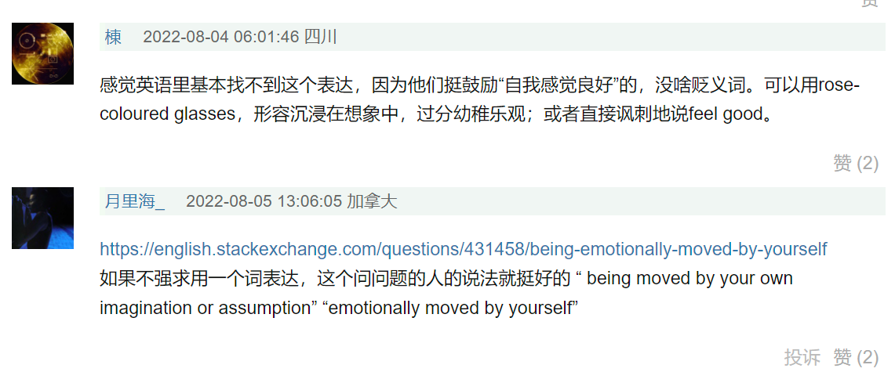

# 一期一会

[「一期一会」是一个日本的四字熟语，表示珍惜每一次不可重复的时刻和相遇的文化理念。[这个词源于茶道的用语，意思是亭主和客人要以一期一会的精神，用真心对待每一次泡茶和品茶的过程。[英语中可以翻译为「for this time only」或「once in a lifetime」。](https://en.wikipedia.org/wiki/Ichi-go_ichi-e)[1](https://en.wikipedia.org/wiki/Ichi-go_ichi-e)

「一期一会」的每个字都有特殊的含义：

- [「一期」是一个佛教用语，指从出生到死亡的一生，也就是人的寿命。](https://en.wikipedia.org/wiki/Ichi-go_ichi-e)[1](https://en.wikipedia.org/wiki/Ichi-go_ichi-e)
- [「一会」是一个汉语词汇，指一次见面或交流，也就是人与人之间的相遇。](https://www.italki.com/en/post/question-35833)[4](https://www.italki.com/en/post/question-35833)
- 「一」字重复两次，表示强调和唯一性，意思是这样的时刻和相遇只有这一次，不会再有第二次。
- 「会」字在日语中读作「え」（e），与「絵」（e，画）同音，暗示了茶道中常用的挂画（掛物）和书画（書画）的艺术元素。

[综上所述，「一期一会」可以理解为「在有限的生命中，珍惜每一次不可复制的相遇和体验」。这个词也与禅宗佛教和无常观念有关，提醒人们要活在当下，不要留恋过去或担忧未来。](https://en.wikipedia.org/wiki/Ichi-go_ichi-e)[1](https://en.wikipedia.org/wiki/Ichi-go_ichi-e)

- 通俗一点，就是一次把事情做对。
  真心一点，就是对做的每一颗芯片，你要用心去爱，爱不是错过了才追悔莫及，当你觉得你不能放弃的时候，你就应该大声喊出来。爱绝不仅仅是满足一下项目要求的 Checklist，其实完美的爱情故事在我们内心都存在，只是迫于周边（可恶的项目经理和 QA）的压力常常选择了苟且。但回望过去，一颗大芯片的开发时间是三年，以我究其十年时间最多也就经历四个大项目（兼职的另算），所以我引用了一期一会这个词，如果我们能够把每一个芯片当成这一生唯一的一次相遇（实际上也是），每一次经历都是人生中独一无二的记忆，把当下的时光看做不会再来，尽其可能表达自己内心最大的诚意，也许故事的结尾就能少一点遗憾了。

我是一个念旧的人，在我桌面摆放了我经历过的所有芯片，但我偶尔摩挲其中的时候，总能回想起当年的同伴和故事，那些嬉笑装逼和酩酊大醉，希望我老去的时候，还能记起。

- @ref  
  作者：夏晶晶  
  链接：https://zhuanlan.zhihu.com/p/600264179

## 求其上得其中

> **《大学》：致知在格物，物格而后知至**

这是修身治国平天下的前一句，事物在矛盾纠缠之中，总会向着其最本质的路径前进。想要推动也罢、修正也罢，甚至使袢子也罢，你终须要多理解技术的一些本质，得到一些基本的判断。摩尔定律也罢、软硬件协同也罢、AI 也罢，如朱熹所说，一草一木，皆涵至理，若能从多种角度寻找不同事物之间的连接和关系，一旦能豁然贯通，则能够用更加简单、抽象、结构化地去看待和理解。以至于我发现越倾向于深入，则会越发站于事物的中心位，也越发容易理解他人的视角或团结他人（以理服人）。

经验来讲，多做做实践，想起来的时候把课本翻出来再读一遍，不妨多做一做一些技术之外有趣的事情，触类旁通，而且其中往往还会伴随一些额外的收益，那某些看着无用的事也会让人觉得人间值得

作者：夏晶晶  
链接：https://zhuanlan.zhihu.com/p/600264179

# Continuous divide and conquer

In nature ,things won\`t just work some suddenly,  
You set up a goal , then you plan the path,  
when you exec the path, you need to refine it to become more smooth,

like a rising curve in coordinate system, you need to derivate it again and again  
to see the details and refine it .

so eventually this macro curve may look like this:  
  
concious mind mode: capable following instructions  
unconcius mode : automatic , fast  
how to build muscle mem for work?  
make work easier .  
practice makes it easier and easier  
remind CS61B that dancing game man .

**thinking takes efforts, fghting through confusion**

## 如何明确目标并保持动力

scrath from 老石谈芯 https://www.bilibili.com/video/BV1c5411V72a/?spm_id_from=trigger_reload&vd_source=d074d0576b6cbd56f8b807d99f34ed18

1. 每日有清单,列出最重要的一两项
2. 剩下的杂项需要做,放到一起去解决

**不努力的时候咋办?**  
想想人医生的工作:  
8 点开始接门诊 一直到下午 6 点 接了 100 个不同情况复杂的病例  
然后 6 点整理病例,准备手术,做科研,有时还要值夜班.  
对精神和体力是极大挑战.  
特别是手术日工作强度大到难以想象  
你不累吗不枯燥吗?你觉得她会怎么回答呢

相比程序员;  
能做着自己喜欢的工作,有吃有喝,累了可以休息,还能一边工作一边听音乐,  
真的要去想枯燥,乏味,辛苦的理由吗?

提高效率的目的只是为了更轻松的生活  
并由此创造更多自由的精神思考空间

可以在晚上想好明天要做什么,如果一早来想的话可能忘记一些

### 做笔记的一些目的

from: https://youtu.be/iYb3O2MockQ  
1.**这个笔记会在未来什么时候用上?**

2.笔记是一种注意力投资,  
ROI Return Of Investment  
ROA Return Of Attention

3.个人知识库

合理分配时间和精神  
精神是仅次于时间的第二资源

以行动为导向来分类笔记 PARA  
project 对现在的事项有帮助  
area 对长期有帮助 如人际关系,身体健康,财务  
resource 未来可能有用的资料,在未来才会产生行动的  
archive 存档的

另外需要 Distill 精炼,也是 Take Home Message  
目的是 快速掌握重点  
从而不浪费收集整理资料花费的时间  
实现:Progrrasive Summarization  
阶层式摘要  
即知道重点,又不失去上下文

## 祛魅

除魅一词在日常语境也可以用，意思其实很简单：  
原本神秘而有魅力的东西因为某种原因突然变得不神秘、没有魅力了。  
也是不对一些不了解没调查过得东西盲目崇拜和向往

# Other funny sayings

One day, I\`ll become the master of CS enginerring field!… or at least, that’s what I keep telling my computer.” 😄

My ultimate goal is to excel in the field of computer science engineering and create innovative solutions for the world ,then, I’ll finally be able to fix my grandma’s computer.” 😂

What an approach to Communism!

from:高效能人士的七个习惯(modifyed)

## 习惯一：积极主动（BE PROACTIVE）

积极主动即采取主动，为自己过去、现在及未来的行为负责，并**依据原则及价值观，而非情绪或外在环境来下决定**。  
积极主动的人是改变的催生者，他们摒弃被动的受害者角色，不怨天尤人，发挥了人类四项独特的禀赋  
——自我意识、良知、想象力和独立意志，  
同时以由内而外的方式来创造改变，积极面对一切。  
他们选择创造自己的人生，这也是每个人最基本的决定。  
1.建立自己的原则和价值观,写下.  
2.察觉到重要事情是否按照价值观在执行?

## 习惯二：以终为始（BEGIN WITH THE END IN MIND）

所有事物都经过两次的创造——先是在脑海里酝酿，其次才是实质的创  
造。个人、家庭、团队和组织在做任何计划时，均先拟出愿景和目标，并据  
此塑造未来，全心投入自己最重视的原则、价值观、关系及目标。对个人、  
家庭或组织而言，使命宣言可以说是愿景的最高形式，它是根本的决策，主  
宰了所有其他决定。领导工作的核心，就是基于共有的使命、愿景和价值  
观，创造出一个文化。 1.即基于价值观拟定的计划,并在过程中认可每件事情

我在某段文字写下自己最 afraid of 的事,现在总是想不起来,但是意识到了很重要,  
对价值观有 fundamental impact.寻找他,并迭代价值观.

# 如果要寻找更好的生活,让自己有得选:

需要:  
1.专业技能  
2.英语: 雅思 7 吧?  
3.存款  
4.合法行为  
这些都是 output  
**需要什么 input?才能接近这几个目标?**

progressive approach,  
progressive transform.  
计划-执行-检验-迭代下次执行  
过程中不断提高效率

# 警醒自己区分努力和自我感动

什么是自我感动:

# (执行层面)Learning to Learn 提高学习效率 