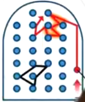
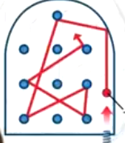
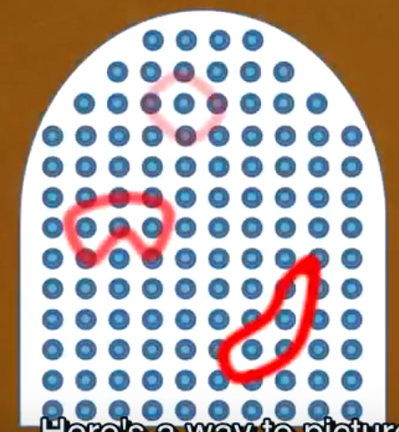

I’m glad you know Descartes’ scientific methodology, which is a useful way to approach complex problems and seek the truth.  
However, I understand that sometimes you may encounter difficulties that make you feel afraid or discouraged.  
That’s normal, and many people have similar feelings  
you don’t have to let fear stop you from **pursuing your goals and interests**

# what happen inside your brain when you study meet chanllenge?

ref: UC course: Learning How to Learn ;Barbara Oakley

brain have 2 modes:
foucs mode :学习新事物的时候  
  
difuse mode: 日常,以及众多熟悉的衣食住行做的事情  
  
学习本身就是在构建小区域的神经网络:当学习中遇到 frastration 的时候,大脑集中在一小块区域解决问题,尚未构建高质量的神经网络:
  
这个过程需要不断地 practice makes permenant  
回想 CS61B 跳脚步舞的那个人.  
也需要在 frastratino 时候稍作休息,进入发散模式,
大脑会自动在后台无意识的帮助解决困难问题.

# aware,觉察 : measure the fear and frastration level

You need to learn how to manage your fear and use it as a catalyst(催化剂) for growth and change.  
Learn **is** a process definnately with challenges.

## Change the view-do:

**reframe your fear**.  
 Instead of seeing fear as a negative or threatening emotion, try to consider it as a positive or helpful one.  
 For example, instead of thinking “I’m afraid of failing this project, think “I’m excited about showing what I can contribute to this project”.  
 Instead of thinking “I’m afraid of speaking in front of the people”, think “I’m excited about share my ideas and curious about what the people thinks of my presentation”.  
 By changing your **perspective**, you can change your **emotional response** and reduce your **anxiety**.  
**view:use positive affirmations**.  
 These are statements that you say to yourself or write down that express your confidence and ability to overcome your fears.  
 “I have overcome many difficulties before and I can do it again”.  
 By repeating these affirmations, you can boost your self-esteem and self-efficacy, and create a positive mindset.

## change the view of frastration

## Things helps: Eats and Excercices: Leave the task for a little while ,Return with power.

**You can have the _biological power_ and potential to overcome challenge.**  
Goal:  
lower your blood pressure, heart rate, and cortisol levels,  
increase your serotonin endorphin(内啡肽) levels. (serotonin:血清素,5-羟色胺 can **reduce feelings** of depression and anxiety and **increase feelings** of joy or happiness).

#### the stuff keep you **sober**: serotonin

sober: means have ability to change the view-do

1.generate it 2. let brain receive it

eats: **tryptophan** Vitamin.D, omega-3 ( vitamin-D and omega-3 fatty acids may modulate(调节) the creation, release, and function of serotonin.)

VD->sunlights: at least **15 minutes of exposure to natural light every day**, preferably in the morning or afternoon

Exercising mechinism:
trigger the*release* of tryptophan into yourblood and _reduce_ the number of otheramino acids. This creates an idealenvironment for more tryptophan toreach your brain and increaseserotonin levels

branched chain amino acids (BCAAs)  _compete with tryptophan_ for transport into the brain,

what level of excise will achive the goal of produceaffective tryptophan ?  
Generally, **moderate to vigorous exercise for atleast 20 minutes can have a significant effect ontryptophan levels**

#### cortisol: the pressure stuff.

todo
