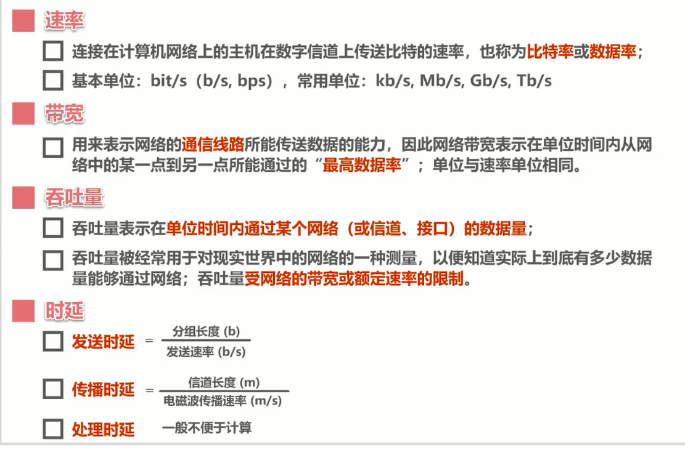
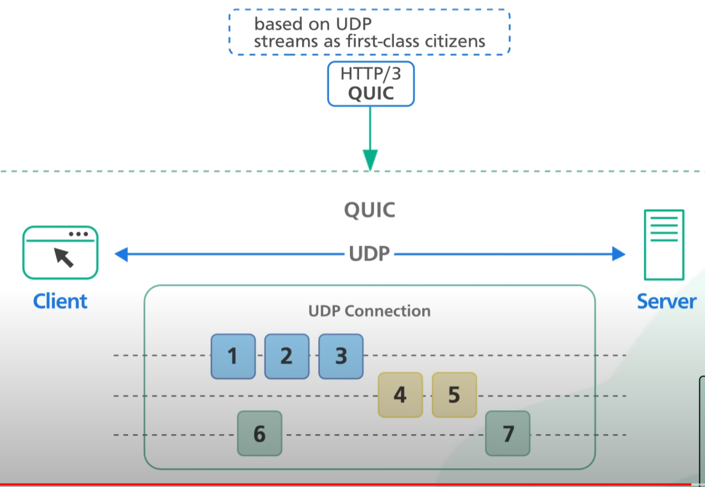
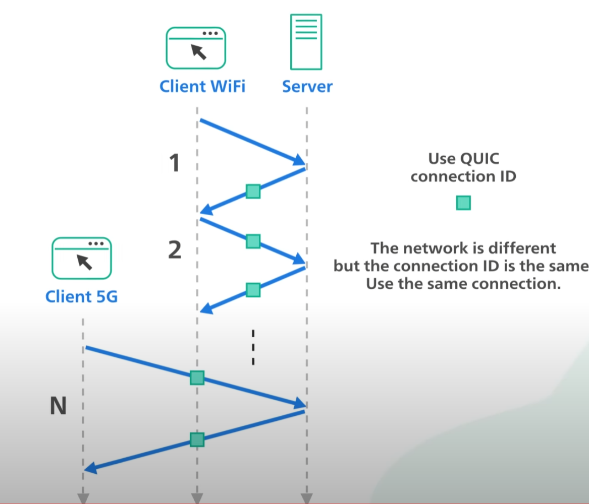
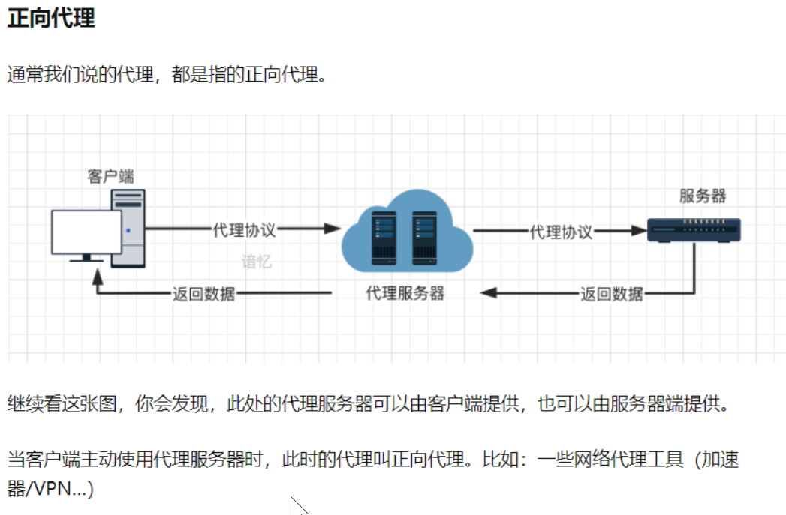
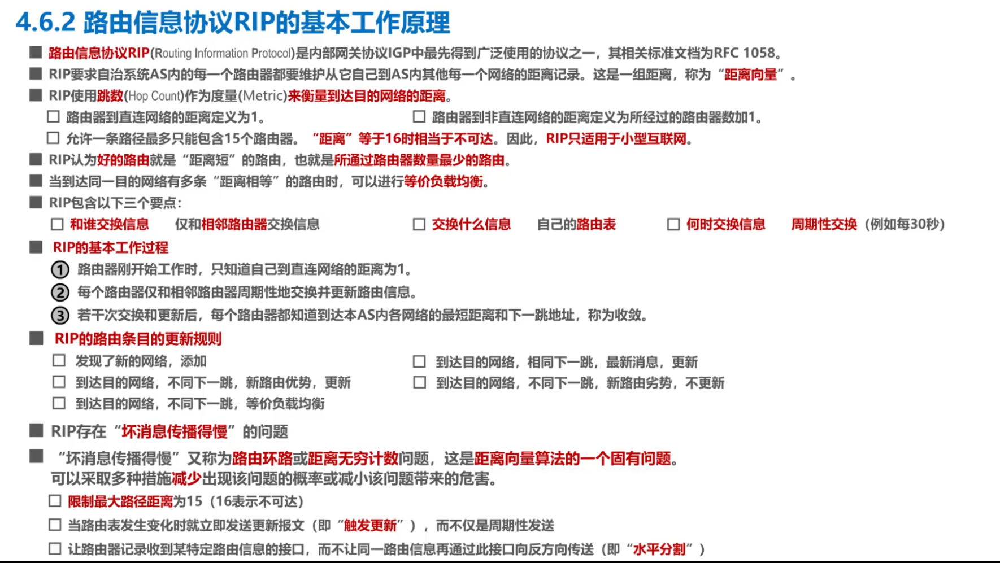
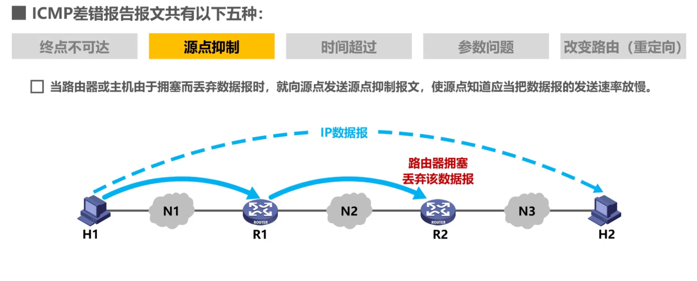
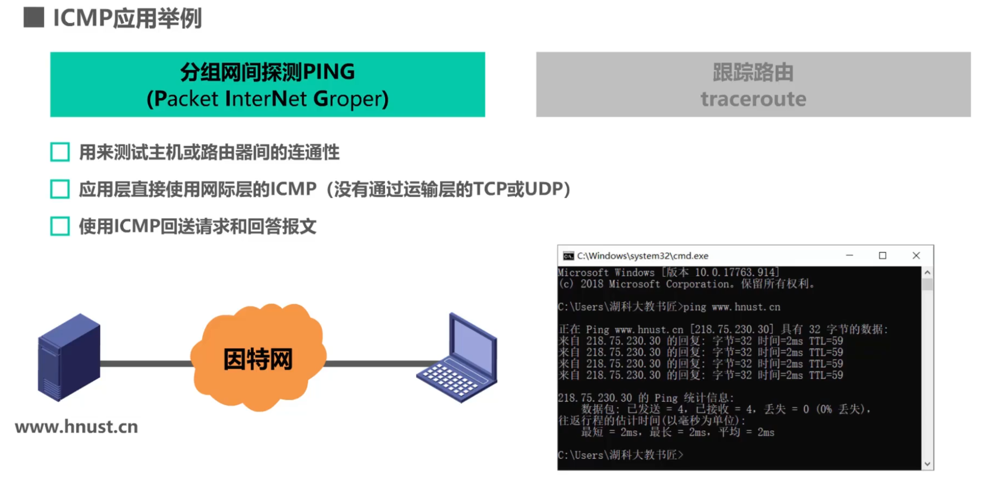
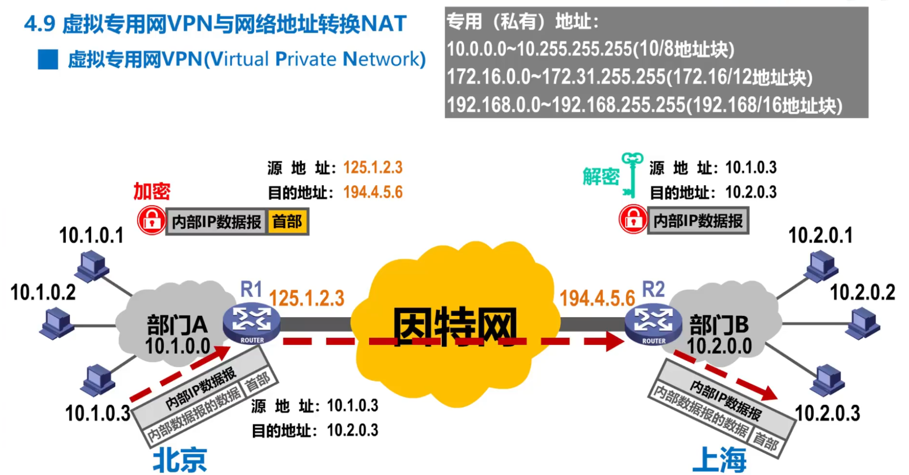

**Computer Network**

概览
====

类比理解 {#类比理解 .list-paragraph}
--------

### 物理层-\>公路修建网络层-\>地图导航路径规划传输层-\>行驶在路上的汽车应用层-\>收发快递的人路径规划ARP IP层和传输规则TCP TCP层是面试常问内容

-   公路是单行道还是双行道?TCP

-   如何找到最优路径,即地图软件如何找到最短路径算法的?是图算法嘛?DFS,BFS?
    > 走迷宫?一条路坏了如何走另一条路?ARP

-   汽车行驶参数有很多,如多辆车,多大的车,堵车怎么办?汽车上面装了用户家里给不同人的物品,如有ps5给A,有鲜花给B-\>(端口)TCP

### 封装过程像是多个压栈,解包过程像是多个出栈.

-   

> {width="1.968503937007874in"
> height="2.522354549431321in"}

数据包格式 {#数据包格式 .list-paragraph}
----------

### 

> {width="1.968503937007874in"
> height="0.9875995188101487in"}

HTTP {#http .list-paragraph}
----

### OS负责端口转发给指定端口接收程序

> {width="1.968503937007874in"
> height="1.3388910761154855in"}

图 {#图 .list-paragraph}
--

### 

> {width="1.968503937007874in"
> height="0.39137576552930886in"}

-   端口号

> • 2\^16: 每一台电脑可以有65535个端口
>
> {width="1.968503937007874in"
> height="0.7523600174978128in"}

### 

> {width="1.968503937007874in"
> height="1.4701881014873142in"}

图 {#图-1 .list-paragraph}
--

### 

> {width="1.968503937007874in"
> height="1.1035553368328959in"}

简单流程 {#简单流程 .list-paragraph}
--------

### 

> {width="1.968503937007874in"
> height="0.9438385826771654in"}

### 应用层

> {width="1.968503937007874in"
> height="0.9063199912510936in"}

### 运输层

> {width="1.968503937007874in"
> height="0.5230993000874891in"}

### 网络层

> {width="1.968503937007874in"
> height="0.6614599737532808in"}

### 数据链路层

> {width="1.968503937007874in"
> height="1.6899420384951882in"}

### 物理层: 编码

> {width="1.968503937007874in"
> height="0.5632589676290464in"}

-   

> {width="1.968503937007874in"
> height="0.7294728783902013in"}

组成 {#组成 .list-paragraph}
----

### 总览

-   

> {width="1.968503937007874in"
> height="1.3870297462817147in"}

### 实体

### 协议

-   语法:即 构成一句话的元素

-   语义:即 逻辑上要做什么事情

### 服务

-   概览

> •
>
> {width="1.968503937007874in"
> height="1.0448392388451444in"}
>
> •
>
> {width="1.968503937007874in"
> height="0.3717060367454068in"}
>
> • Protocol Data UnitService Data Unit
>
> {width="1.968503937007874in"
> height="1.0496270778652668in"}

CN by scales  {#cn-by-scales .list-paragraph}
------------

### 子主题 1

> {width="1.968503937007874in"
> height="4.040917541557305in"}

网络分层
========

原因:层次化之后，设计也变得相对简单了。处于应用层上的应用可以只考虑分派给自己的任务，而不需要弄清对方在地球上哪个地方、对方的传输路线是怎样的、是否能确保传输送达等问题。 {#原因层次化之后设计也变得相对简单了处于应用层上的应用可以只考虑分派给自己的任务而不需要弄清对方在地球上哪个地方对方的传输路线是怎样的是否能确保传输送达等问题 .list-paragraph}
-------------------------------------------------------------------------------------------------------------------------------------------------------------------------

概览 {#概览-1 .list-paragraph}
----

### 

> {width="1.968503937007874in"
> height="0.8056747594050744in"}

### 

> {width="1.968503937007874in"
> height="0.9101399825021872in"}

子主题 5 {#子主题-5 .list-paragraph}
--------

### 

> {width="1.968503937007874in"
> height="2.83417104111986in"}

子主题 5 {#子主题-5-1 .list-paragraph}
--------

### 网络传输时候的封装与解封装/decapsulation

> {width="1.968503937007874in"
> height="2.0836679790026245in"}

性能指标
========

8个基本指标 {#个基本指标 .list-paragraph}
-----------

> {width="0.6988188976377953in"
> height="2.982283464566929in"}

### 速率

-   

> {width="1.968503937007874in"
> height="0.5656036745406824in"}

-   注意数据量和速率的差别,但是粗略计算也可以约分

> {width="1.968503937007874in"
> height="0.4626224846894138in"}

### 带宽

-   

> {width="1.968503937007874in"
> height="0.9171751968503937in"}

### 吞吐量

-   指 根据带宽得到的实际测量值

> {width="1.968503937007874in"
> height="0.7773064304461942in"}

-   木桶效应

> {width="1.968503937007874in"
> height="0.6358442694663167in"}

### 时延

-   不同网卡有不同性能,内可能还有排队时延

> {width="1.968503937007874in"
> height="0.9563757655293088in"}

-   简单计算题帮助理解

> {width="1.968503937007874in"
> height="0.8097856517935258in"}

### 小总结

-   

> {width="1.968503937007874in"
> height="1.306370297462817in"}

### 时延带宽积

-   

> {width="1.968503937007874in"
> height="0.953076334208224in"}

### 往返时间与常说的延迟有关如65ms

-   双向交互时间:从发送到接收时间段计时

> {width="1.968503937007874in"
> height="1.0178608923884513in"}

### 利用率

-   

> {width="1.968503937007874in"
> height="1.0229844706911635in"}

### 丢包率

-   路由器对列即将满,则丢弃收到的包,丢弃的原因:为了不让队列无限增大.不然后来的数据包将无限等待.

> {width="1.968503937007874in"
> height="0.926505905511811in"}

-   加速器的原理就是为用户选择不那么拥塞的网络路径,减少丢包即IP层
    > .路径选择那么TCP层有做什么吗? todo

### 小总结

-   

> {width="1.968503937007874in"
> height="1.149491469816273in"}

the Internet
============

consist of devices {#consist-of-devices .list-paragraph}
------------------

4 应用层:如HTTP,gateway,FTP,
============================

概览 {#概览-2 .list-paragraph}
----

### 以及后来的物联网

> {width="1.968503937007874in"
> height="0.5784875328083989in"}

连接方式:C/S架构p2p架构peer to peer {#连接方式cs架构p2p架构peer-to-peer .list-paragraph}
-----------------------------------

### 在这里有个问题: S总是不知道C还在不在,无法检测,除非指定C端必须定时检测

> {width="1.968503937007874in"
> height="1.0496795713035871in"}

### 子主题 2

> {width="1.968503937007874in"
> height="0.7149453193350831in"}

Browser/Server architecture  {#browserserver-architecture .list-paragraph}
---------------------------

### pros:compare to C/Smainly is available:offer that function to user 

-   1\. always newest and same version . ez to control version

-   2\. data centerilizeez to share

-   3\. cross platform

-   4\. reduce client-side reqs such as \*heavy computation give to
    > server \*

### cons

-   secutrity:

> •
> transparency用户可以直接f12查看大量内部接口和逻辑C/S架构则是经过编译完成的二进制文件

HTTP {#http-1 .list-paragraph}
----

### 网站URL:即网址,方便人们记忆和表达网站主题网页内容URI( Uniform Resource Identifier ).统一资源定位符URL(Uniform Resource Locator)

-   

> {width="1.968503937007874in"
> height="0.38916666666666666in"}

-   通过DNS解析得到ip地址进行传输

### 1.请求和响应:GET/POST

-   请求/GET

> {width="1.968503937007874in"
> height="0.48573490813648296in"}

-   响应/POST

> {width="1.968503937007874in"
> height="1.3176596675415573in"}

### 逐渐发明的技术:

-   1.持久化链接HTTP keep-alive /presistent connection下层由TCP保持连接

> {width="1.968503937007874in"
> height="1.6050874890638671in"}
>
> •
>
> {width="1.968503937007874in"
> height="1.8667607174103238in"}

-   2.管线化/pipeline/ 对比并发来理解 concurrent/ 并发 concurrency
    > parallel /并行 parallelism即AIO 异步IO ,可以是非阻塞式的

> {width="1.968503937007874in"
> height="1.5295505249343833in"}

-   3.使用Cookie的状态管理,C/S端保存C端的信息.下次S端认识C端个人信息

> {width="1.968503937007874in"
> height="1.5213374890638671in"}
>
> • 对比session
>
> {width="1.968503937007874in"
> height="1.6209120734908136in"}
>
> • session本质是一个map且线程安全,支持并发
>
> •
>
> {width="1.968503937007874in"
> height="0.2912817147856518in"}
>
> •
>
> {width="1.968503937007874in"
> height="0.1022594050743657in"}
>
> •
>
> {width="1.968503937007874in"
> height="0.2110411198600175in"}
>
> •
>
> {width="1.968503937007874in"
> height="8.710192475940508e-2in"}
>
> • session使用:
>
> •
>
> {width="1.968503937007874in"
> height="0.26272090988626423in"}
>
> • 以及还有redis使用(服务器端)

### HTTP概览1.本质是在进行文本传输2.双方需要解析器(Interpreter)3.共同约定好语法语义

-   报文结构

> • 子主题 1
>
> {width="1.968503937007874in"
> height="1.012840113735783in"}
>
> • 子主题 1
>
> {width="1.968503937007874in"
> height="1.7964173228346456in"}

-   状态码

> • 子主题 1
>
> {width="1.968503937007874in"
> height="0.6261373578302712in"}

-   网关

> • 子主题 1
>
> {width="1.968503937007874in"
> height="1.4240244969378828in"}
>
> • 是否不必存在?因为都可以通过后端调用?

### HTTPS

> {width="1.968503937007874in"
> height="0.17485236220472442in"}

-   原因

> • 子主题 1
>
> {width="1.968503937007874in"
> height="0.8195231846019247in"}
>
> • 子主题 2
>
> {width="1.968503937007874in"
> height="0.20669291338582677in"}

-   SSL（Secure Socket Layer，安全套接层）

> • 子主题 1
>
> {width="1.968503937007874in"
> height="1.271956474190726in"}

-   对称加密:共享秘钥

-   非对称加密:1.公钥

> • 是否是hash(private key ) 然后得到 pub key?
>
> {width="1.968503937007874in"
> height="1.3869006999125109in"}
>
> • 子主题 2

-   证书

> • 子主题 1
>
> {width="1.968503937007874in"
> height="1.5365660542432196in"}
>
> • 子主题 1
>
> {width="1.968503937007874in"
> height="0.4055282152230971in"}

-   TLS（Transport Layer Security，安全层传输协议）

> • 子主题 1

-   要解决的问题

> • 1.确定双方身份
>
> • 2.确定线路安全:可以被偷听,但是无法解析即可
>
> • 子主题 3

### HTTP 协议演化1-\> 2 -\> 3proxy evolve

-   youtube:
    > todohttps://www.youtube.com/watch?v=a-sBfyiXysI&ab\_channel=ByteByteGo

> • 子主题 1

-   子主题 2

> {width="1.968503937007874in"
> height="0.8489009186351706in"}
>
> • 1
>
> • 每次都要建立连接
>
> {width="1.968503937007874in"
> height="3.137409230096238in"}
>
> • 1.1
>
> • keep-alive 和 pipeline 同样重要的两个特性
>
> {width="1.968503937007874in"
> height="0.7080774278215223in"}
>
> • 子主题 1
>
> {width="1.968503937007874in"
> height="1.0428160542432197in"}
>
> • 子主题 2
>
> {width="1.968503937007874in"
> height="1.3828051181102363in"}
>
> • 子主题 3
>
> {width="1.968503937007874in"
> height="2.2541393263342084in"}
>
> • 2
>
> • 子主题 1
>
> {width="1.968503937007874in"
> height="0.8051531058617672in"}
>
> • 3
>
> • 子主题 1
>
> {width="1.968503937007874in"
> height="1.3624114173228346in"}
>
> • 在设备切换网络即换了IP层网路时,不用反复重建TCP连接
>
> {width="1.968503937007874in"
> height="1.6881321084864391in"}

DNS {#dns .list-paragraph}
---

### DNS abstraction:input: urloutput: ip

-   注册一个DNS解析即是输入 K V 值即可

### 

> {width="1.968503937007874in"
> height="1.8321423884514436in"}

### 是否实现就是一个HashTable?yes至少在分布式以下的层级如一个ISP提供商,整个cn的DNS是用的HashTable

-   K:name -\> V: ip

### 分层的且分布式的

-   子主题 1

> {width="1.968503937007874in"
> height="0.5005380577427821in"}

FTP {#ftp .list-paragraph}
---

### 

> {width="1.968503937007874in"
> height="3.2484055118110238in"}

DHCP {#dhcp .list-paragraph}
----

### 

> {width="1.968503937007874in"
> height="2.5272812773403324in"}

gateway网关 {#gateway网关 .list-paragraph}
-----------

{width="0.23622047244094488in"
height="0.23622047244094488in"}

### what is network proxy?

-   1.保护2.分流两者同样重要

> {width="1.968503937007874in"
> height="0.6723950131233596in"}

-   子主题 2

> {width="1.968503937007874in"
> height="1.5376968503937007in"}

### foward proxy

-   子主题 1

> {width="1.968503937007874in"
> height="1.2927952755905512in"}

-   子主题 2

> {width="1.968503937007874in"
> height="1.0637051618547682in"}

-   子主题 3

> {width="1.968503937007874in"
> height="2.3692246281714784in"}

### reserve proxy

-   子主题 1

> {width="1.968503937007874in"
> height="1.6199726596675414in"}

-   子主题 2

> {width="1.968503937007874in"
> height="2.545136701662292in"}

-   子主题 3

> {width="1.968503937007874in"
> height="0.17833114610673667in"}

3 传输层:如TCP
==============

{width="0.23622047244094488in"
height="0.23622047244094488in"}

概览 {#概览-3 .list-paragraph}
----

### 1.拆包2.解决传输包问题: 1.丢包 2.误码 3.包顺序错误

> {width="1.968503937007874in"
> height="0.9630096237970254in"}

端口 port {#端口-port .list-paragraph}
---------

### 为什么需要端口?

-   总结:统一一台电脑上多个程序发送的网络数据归类之,不至于混淆不同程序发送的内容

> {width="1.968503937007874in"
> height="0.5347692475940508in"}

### 端口号的分配

-   一般写网络程序可以考虑用登记端口号或者短暂端口号

> {width="1.968503937007874in"
> height="0.3843821084864392in"}

-   

> {width="1.968503937007874in"
> height="0.6037084426946632in"}

IP 的复用/分用 {#ip-的复用分用 .list-paragraph}
--------------

### 

> {width="1.968503937007874in"
> height="1.63253280839895in"}

-   

> {width="1.968503937007874in"
> height="1.631596675415573in"}

UDP/TCP对比 {#udptcp对比 .list-paragraph}
-----------

### 图

-   直接,快速,简洁

> {width="1.968503937007874in"
> height="0.9864785651793526in"}

-   

> {width="1.968503937007874in"
> height="0.9324496937882765in"}

-   TCP有缓存控制(首发双方都有,互相通信查看对方的缓存情况)

> {width="1.968503937007874in"
> height="0.9409492563429571in"}

-   

> {width="1.968503937007874in"
> height="0.984251968503937in"}

-   是不是校验和也可以不要了?更快.或者是不解析校验和

> {width="1.968503937007874in"
> height="0.8746314523184602in"}

-   从信息熵(Info Entropy)方面来看.UDP更接近平均熵.更高效

> {width="1.968503937007874in"
> height="0.8356583552055993in"}
>
> •
>
> {width="1.968503937007874in"
> height="1.5894181977252844in"}

UDP {#udp .list-paragraph}
---

### concept

> {width="1.968503937007874in"
> height="0.2824015748031496in"}

### 格式

-   

> {width="1.968503937007874in"
> height="1.5603477690288714in"}

### 应用领域

-   如

> •
>
> {width="1.968503937007874in"
> height="0.6244181977252843in"}

TCP {#tcp .list-paragraph}
---

### concept

-   

> {width="1.968503937007874in"
> height="0.398581583552056in"}

-   TCP是面向连接的、可靠的流协议。流就是指不间断的数据结构，
    > 你可以把它想象成排水管道中的水流。

### 三报文握手概念

-   

> {width="1.968503937007874in"
> height="1.2959897200349957in"}

-   

> {width="1.968503937007874in"
> height="0.6396751968503936in"}

-   为什么要三次握手?三次握手的目的是建立可靠的通信信道，说到通讯，简单来说就是数据的发送与接收，

-   而三次握手最主要的目的就是双方确认自己与对方的发送与接收是正常的。

-   第一次握手：Client 什么都不能确认；Server
    > 确认了对方发送正常，自己接收正常第二次握手：Client
    > 确认了：自己发送、接收正常，对方发送、接收正常；Server
    > 确认了：对方发送正常，自己接收正常第三次握手：Client
    > 确认了：自己发送、接收正常，对方发送、接收正常；Server
    > 确认了：自己发送、接收正常，对方发送、接收正常所以三次握手就能确认双方收发功能都正常，缺一不可

-   C端视角:自己的发送接收是否正常?S端的发送和接收是否正常?

-   S端视角:自己的发送接收是否正常?C端的发送和接收是否正常?

-   

> {width="1.968503937007874in"
> height="0.7535958005249344in"}

-   

> {width="1.968503937007874in"
> height="1.9025207786526683in"}
>
> • 超时
>
> {width="1.968503937007874in"
> height="1.8310389326334209in"}

### 四报文挥手

-   

> {width="1.968503937007874in"
> height="3.9532097550306213in"}

### 格式

-   

> {width="1.968503937007874in"
> height="1.4582994313210849in"}

-   子主题 4

### ACKPositive Acknowledgement

-   NACK: Negative Acknowledgement

-   ACK

### 流量控制

-   outline

> •
>
> {width="1.968503937007874in"
> height="0.5368646106736658in"}

-   前提

> • 滑动窗口
>
> • 即指定变长的传输包组合量
>
> •
> https://www.bilibili.com/video/BV1c4411d7jb?p=60&spm\_id\_from=pageDriver&vd\_source=d074d0576b6cbd56f8b807d99f34ed18p60

-   例子图

> •
>
> {width="1.968503937007874in"
> height="0.9770505249343832in"}

### 阻塞控制

-   概念

> •
>
> {width="1.968503937007874in"
> height="1.0967377515310586in"}

2 网络层:IP
===========

{width="0.23622047244094488in"
height="0.23622047244094488in"}

ip数据报格式 {#ip数据报格式 .list-paragraph}
------------

### 

> {width="1.968503937007874in"
> height="1.1767213473315836in"}

### 

> {width="1.968503937007874in"
> height="2.615774278215223in"}

### ip地址

-   组成

> • 由4个8位bit组成

概览 {#概览-4 .list-paragraph}
----

### 

> {width="1.968503937007874in"
> height="0.9332874015748032in"}

### ARP最为重要和根本:解决路线选择问题

> {width="1.968503937007874in"
> height="1.968503937007874in"}

路由ARP {#路由arp .list-paragraph}
-------

### 简单的静态路由

### 动态路由选择

-   Internet的路由选择协议

> • goal
>
> • 子主题 1
>
> {width="1.968503937007874in"
> height="0.9308639545056868in"}
>
> • impl
>
> • 子主题 1
>
> {width="1.968503937007874in"
> height="0.8130129046369203in"}
>
> • 子主题 2
>
> • 子主题 1
>
> {width="1.968503937007874in"
> height="0.8645614610673665in"}
>
> • 子主题 3
>
> •
> 一种是用表的报文.查表然后转发给下个地址一种是更新表的报文.则更新表,然后可能发给下个路由器让他也更新路由表
>
> {width="1.968503937007874in"
> height="0.9896183289588801in"}
>
> • RIP最重要,核心的路径选择权重:
> 距离最短?容量最大?有时不可兼得所以要根据上层提出的需求选择链路如做FTP选择的路线做UDP实时游戏选择的路线
>
> • 子主题 1
>
> {width="1.968503937007874in"
> height="0.98293416447944in"}
>
> • 子主题 2
>
> • 以链路点数量作为唯一权重
>
> {width="1.968503937007874in"
> height="1.1171828521434821in"}
>
> • 自动负载均衡
>
> {width="1.968503937007874in"
> height="0.9770680227471567in"}
>
> • 子主题 3
>
> • 子主题 1
>
> {width="1.968503937007874in"
> height="0.965323709536308in"}
>
> • 例子
>
> • 子主题 1
>
> {width="1.968503937007874in"
> height="1.0094247594050743in"}
>
> • 子主题 2
>
> {width="1.968503937007874in"
> height="0.7585553368328959in"}
>
> • 子主题 2
>
> {width="1.968503937007874in"
> height="1.0520199037620297in"}
>
> • 子主题 1
>
> {width="1.968503937007874in"
> height="0.8953324584426947in"}
>
> • 子主题 3
>
> {width="1.968503937007874in"
> height="0.7229111986001749in"}
>
> • 子主题 5
>
> {width="1.968503937007874in"
> height="1.0438046806649168in"}
>
> • 子主题 6
>
> {width="1.968503937007874in"
> height="1.110084208223972in"}
>
> • OSPF
>
> • 子主题 1
>
> • 子主题 1
>
> {width="1.968503937007874in"
> height="0.9094149168853893in"}
>
> • 子主题 2
>
> • 子主题 1
>
> {width="1.968503937007874in"
> height="1.0508880139982502in"}
>
> • 子主题 3
>
> • 子主题 1
>
> {width="1.968503937007874in"
> height="1.1642224409448818in"}
>
> • 子主题 4
>
> • 子主题 1
>
> {width="1.968503937007874in"
> height="1.1035553368328959in"}
>
> • beautiful!
>
> • 抽象为图,然后计算加权的最短路径;用来构建路由表
>
> {width="1.968503937007874in"
> height="1.0620669291338583in"}
>
> • 子主题 6
>
> • 子主题 1
>
> {width="1.968503937007874in"
> height="0.9210629921259843in"}
>
> • 子主题 7
>
> • 子主题 1
>
> {width="1.968503937007874in"
> height="0.9266371391076116in"}
>
> • 子主题 8
>
> • 子主题 1
>
> {width="1.968503937007874in"
> height="0.9544258530183727in"}
>
> • BGP
>
> • 把洪泛限制在Area中
>
> • 子主题 1
>
> {width="1.968503937007874in"
> height="0.9378357392825897in"}
>
> • 子主题 2
>
> • 子主题 1
>
> {width="1.968503937007874in"
> height="0.8695374015748032in"}
>
> • 子主题 3
>
> • zzz
>
> {width="1.968503937007874in"
> height="0.8508114610673666in"}
>
> • 子主题 4
>
> • 子主题 1
>
> {width="1.968503937007874in"
> height="0.5215496500437445in"}
>
> • 子主题 5
>
> • 子主题 1
>
> {width="1.968503937007874in"
> height="1.2328521434820647in"}
>
> • IPv4数据报格式简称ip数据报
>
> • 子主题 1
>
> • 子主题 1
>
> {width="1.968503937007874in"
> height="1.2583869203849518in"}
>
> • 子主题 1
>
> {width="1.968503937007874in"
> height="0.6410214348206474in"}
>
> • 子主题 2
>
> {width="1.968503937007874in"
> height="0.4962849956255468in"}
>
> • 为什么DF位不在MF位前面.要先能分片,再考虑MF分片情况呀!
>
> {width="1.968503937007874in"
> height="0.4843558617672791in"}
>
> • 直接整成无限大.污染整个网络.当然不可能.有检查最大数机制的哈哈
>
> {width="1.968503937007874in"
> height="0.41720581802274714in"}
>
> • 子主题 1
>
> {width="1.968503937007874in"
> height="0.9412718722659668in"}
>
> • 子主题 5
>
> {width="1.968503937007874in"
> height="0.6309820647419072in"}
>
> • 子主题 1
>
> • 子主题 6
>
> {width="1.968503937007874in"
> height="0.4968066491688539in"}
>
> • 子主题 7
>
> {width="1.968503937007874in"
> height="0.18202318460192476in"}
>
> • 分片例子
>
> • 子主题 1
>
> {width="1.968503937007874in"
> height="0.995323709536308in"}
>
> • 子主题 2
>
> {width="1.968503937007874in"
> height="0.9944991251093613in"}
>
> • ICMPInternet Control Message Protocol
>
> • 子主题 6
>
> • 子主题 3
>
> • 子主题 1
>
> {width="1.968503937007874in"
> height="0.8098928258967629in"}
>
> • 子主题 4
>
> • 也可能是H2满了
>
> {width="1.968503937007874in"
> height="0.7942180664916886in"}
>
> • 子主题 1
>
> {width="1.968503937007874in"
> height="0.9211187664041994in"}
>
> • 子主题 5
>
> • 子主题 1
>
> {width="1.968503937007874in"
> height="0.832069116360455in"}
>
> • 子主题 1
>
> {width="1.968503937007874in"
> height="0.8001618547681539in"}
>
> • 子主题 1
>
> • 子主题 1
>
> {width="1.968503937007874in"
> height="0.8200382764654418in"}
>
> • 子主题 2
>
> • 子主题 1
>
> {width="1.968503937007874in"
> height="0.8281430446194226in"}
>
> • 子主题 2
>
> • 子主题 1
>
> {width="1.968503937007874in"
> height="0.6001115485564305in"}
>
> • app
>
> • 子主题 1
>
> • 子主题 1
>
> {width="1.968503937007874in"
> height="0.9459317585301837in"}
>
> • 子主题 2
>
> • 子主题 1
>
> {width="1.968503937007874in"
> height="0.957846675415573in"}
>
> • 子主题 1
>
> {width="1.968503937007874in"
> height="1.1659919072615923in"}
>
> • 原理.设置1到X的TTL来获取路径上面的每一个路由器
>
> • 子主题 1
>
> {width="1.968503937007874in"
> height="0.8652766841644794in"}
>
> • 子主题 2
>
> {width="1.968503937007874in"
> height="0.9467410323709536in"}
>
> • 子主题 4
>
> {width="1.968503937007874in"
> height="1.066003937007874in"}
>
> • VPN
>
> • 子主题 1
>
> • 子主题 1
>
> {width="1.968503937007874in"
> height="1.0348764216972879in"}
>
> • 子主题 1
>
> {width="1.968503937007874in"
> height="0.9958792650918635in"}
>
> • 子主题 2
>
> • 子主题 1
>
> {width="1.968503937007874in"
> height="1.0301706036745406in"}
>
> • 子主题 1
>
> {width="1.968503937007874in"
> height="0.9678937007874016in"}
>
> • 子主题 3
>
> • 子主题 1
>
> • NAT

-   net\_gate即net\_route

> • 早期用的网关.现代采用路由 术语

### 对比

-   

> {width="1.968503937007874in"
> height="0.6372211286089239in"}

1 链路层,物理层
===============

概览 {#概览-5 .list-paragraph}
----

### 

> {width="1.968503937007874in"
> height="0.9383912948381452in"}

MAC地址Media Access Control Address {#mac地址media-access-control-address .list-paragraph}
-----------------------------------

### 由6个8位bit组成(48位)

ARP:Address Resolution Protocol负责辅助mac地址,如查找 {#arpaddress-resolution-protocol负责辅助mac地址如查找 .list-paragraph}
-----------------------------------------------------

### 图

-   

> {width="1.968503937007874in"
> height="1.921634951881015in"}

网络接口,以太网驱动 {#网络接口以太网驱动 .list-paragraph}
-------------------

### Ethernet

-   校验的设计

> •
>
> {width="1.968503937007874in"
> height="0.2703357392825897in"}

电路交换 {#电路交换 .list-paragraph}
--------

### 概念

-   

> {width="1.968503937007874in"
> height="1.1037281277340332in"}

分组交换 {#分组交换 .list-paragraph}
--------

### 概念

-   

> {width="1.968503937007874in"
> height="1.162742782152231in"}

-   

> {width="1.6633858267716535in"
> height="0.7874015748031497in"}
>
> •
>
> {width="1.1811023622047243in"
> height="0.8366141732283464in"}

各种电路交换的对比 {#各种电路交换的对比 .list-paragraph}
------------------

### 

> {width="1.968503937007874in"
> height="0.9069903762029746in"}

### 

> {width="1.968503937007874in"
> height="0.44291338582677164in"}

概览 {#概览-6 .list-paragraph}
----

### 

> {width="1.968503937007874in"
> height="0.942843394575678in"}

功能:提供比特流 {#功能提供比特流 .list-paragraph}
---------------

### 如何提供?

-   时钟高低电压

应用这些知识
============

{width="0.23622047244094488in"
height="0.23622047244094488in"}

NAT(Network Address Translation) traverse内网穿透,打洞 {#natnetwork-address-translation-traverse内网穿透打洞 .list-paragraph}
------------------------------------------------------

{width="0.23622047244094488in"
height="0.23622047244094488in"}

### 应用:

-   异地访问局域网NAT中的电脑.因为大多数个人没有ipv4,有也不固定.是一堆人用一个ipv4

爬虫scrapy {#爬虫scrapy .list-paragraph}
----------

\<\<CNATDAP\>\> {#cnatdap .list-paragraph}
---------------

{width="0.23622047244094488in"
height="0.23622047244094488in"}

### wireshark lab

### socket programming lab
