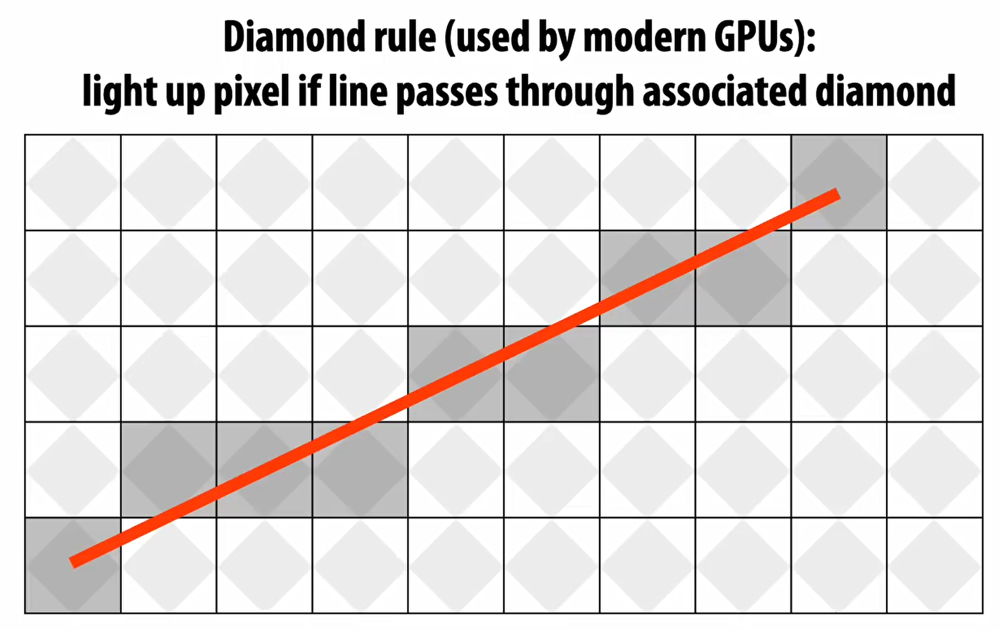

---
---

---

layout: post
title: "Computer Graphics"
categories: [CG]

# pinned: true

---

# Intro

**Computer Graphics defination:**

Describes any use of computers to **create** and **manipulate** images.

We study the standard teminology and concepts of CG, which can **map** nicely to most actual API (computer hardware and software combination enviroment).

## Graphics Areas

**Modeling** deals with the mathematical specification of shape and appearance properties in a way that can be **stored on the computer**.  
 **Rendering** is a term inherited from art and deals with the creation of **shaded images** from 3D computer models.Also , rendering is a process that the generate a 2D or 3D image from a model .  
   
**Animation** is a technique to create an illusion of motion through sequences of images. Animation uses modeling and rendering but adds the key issue of movement over time, which is not usually dealt with in basic modeling and rendering.

## Homogeneous coordinate System

齐次坐标可让包括无穷远点的点坐标以有限坐标表示

## Perspective Projection

  

## Rasterization

pixels:  

  
Question:
  
Some Approach:
  

