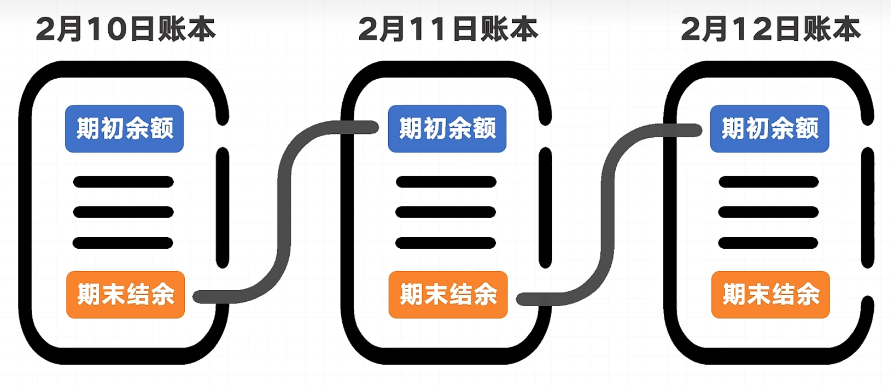
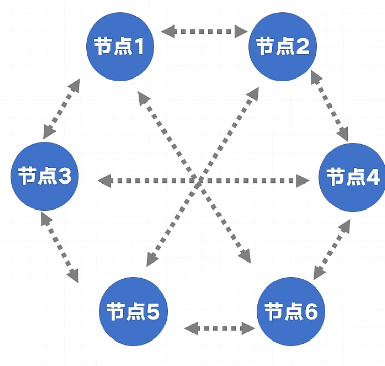
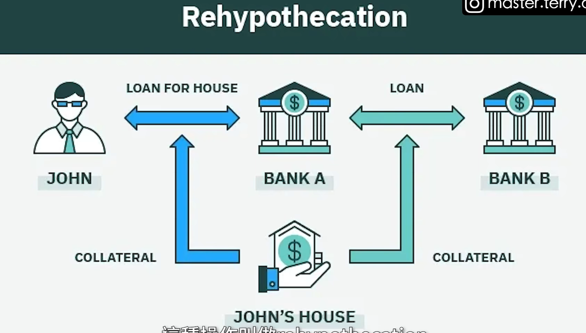
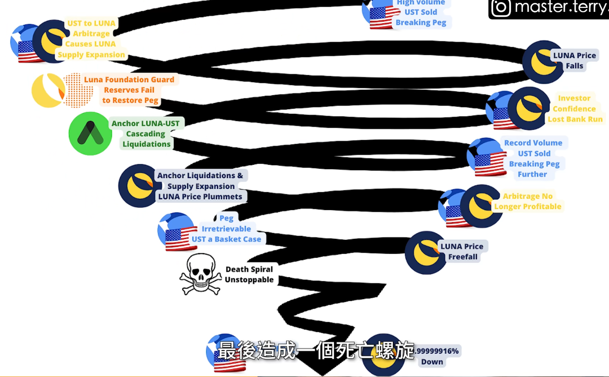

### 区块链：

以一个时间间隔为链表的分布式账本。  
  

### 账本同步方式 :p2p 网络路由

即账本传输链路由 p2p 各个用户分发给附近的  
  

### 记账者收工作费用:

#### 共识算法

谁记那个区块，就收工作费用，  
选举记账者: 如:使用 20 次投硬币，谁最多正面谁记账  
共识算法的一种  

rpc  
local procedure call to rpc  

grpc  

什么时候什么场景必用 rpc 吗？  
tradeoff 是什么  

# 安全 安全 还是安全

## 共识治理
ETH发明了代码上链的概念  
**但是,我发现IC的代码也上链,当要修改链上代码的时候,怎么不见Governance系统介入的?**
理想情况是,要更新IC这个罐子的代码,做出一个提议,然后可能需要1/2 或者2/3 的人来投票是否更新这个代码上链.
且 代码如何做到对用户完全透明?

这违法了Unbreakable Promise的约定. 

为什么说你放在中心化交易平台的钱包是不安全的.

即,为什么中心化交易平台有权限操作你的钱包来转账?特别是转出?

为什么发生恐慌挤兑会导致交易所倒闭?  
如果交易所完全不会私自动用用户的钱包,只是完全自动化的无情代码?  
他会在数学模型上面被某些行为所导致数据崩溃吗?

有公司想你约定说: 你来stake 100个货币,我每个月给你 0.2 个货币.
相当于这个公司完全控制了你的货币拿去使用和运作和**流通**,有暴雷风险.

## Hack
另外,Hack为什么可以偷走交易中心的货币?
最根本的是做了哪个操作?

## Rehypothecation, 收了用户的钱,再拿去做抵押.循环这样做.

破产:简单意思就是,你的钱没了,我也不用还你了

## 挤兑
骨牌效应,从小的挤兑到越来越大,**失去信心**
说明很多平台本身可能宣称自己是Unbreakable Promise. 但是还是有漏洞, 或者说是自己主动做了危险操作,且对用户不透明.

比如FTX暴雷, 始于一个人,发推要卖掉500 M 的USD的FTX货币. 直接蝴蝶效应?骨牌效应了?

### 历史观点: 在唯物史观下,这些在长期看来都是一个发展的过程
最后目标总是Unbreakable Promise 以及 Transparency 以及 群众监督和指定修改规则: Concenensus Governance

另外一些经济学原理,降息和加息的直接必然影响有什么?
像是数学推理,但是只做基本的前几步骤,后面难以推算.

