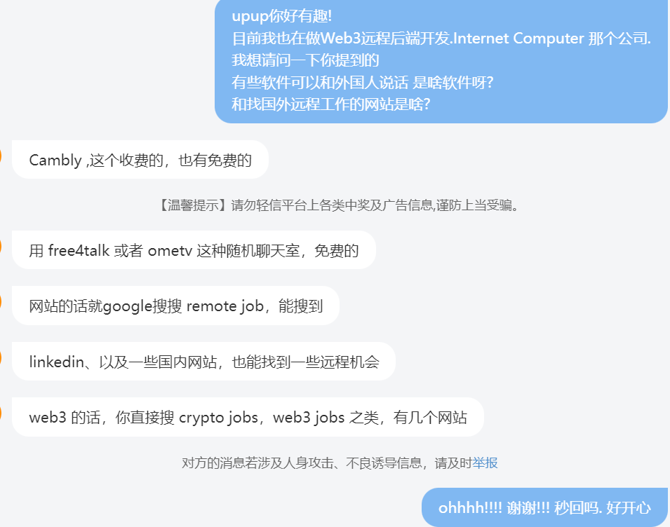

ref: https://space.bilibili.com/4848323

# 1.Why :

提炼关键:**地理套利**  
做一样的工作(唯一可能语言不同),但是  
如微软 41 级:  
中国程序员 45w RMB. 美国程序员 20w USD

# 长期主义

# 2.English

把自己浸泡在英语里面  
即外界和内界  
衣食住行,工作学习全都可以大胆尝试英文  
思考也可以是英文,写作业可以是英文  
找机会做英语口语交流

# 3. Connection to people

也是一个 浸泡  
参与项目的力所能及的方面,让别人知道你这个人.  
邮件来往,多探索交流

# 行业:

## Web3

